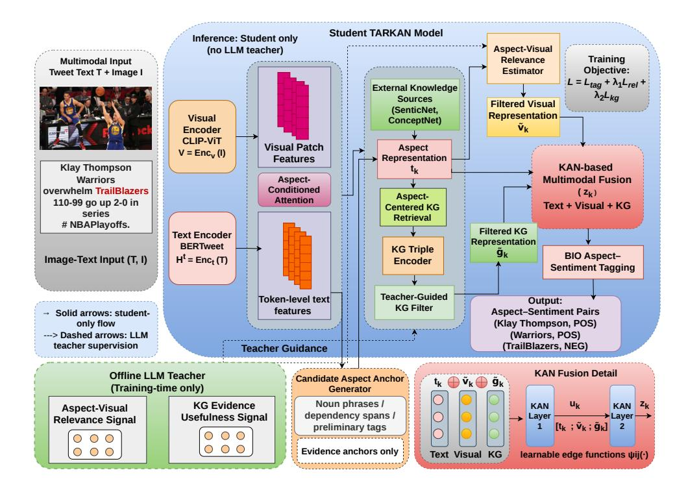

## Highlights

## TARKAN: Teacher-Guided Aspect-Relevant Knowledge Fusion with KAN for Multimodal Aspect-Based Sentiment Analysis

Lipika Dewangan, Udit Senapaty, Chandresh Kumar Maurya

- Propose TARKAN for teacher-guided multimodal ABSA.
- Use an offline LLM teacher for visual and KG evidence filtering.
- Estimate aspect-visual relevance to reduce image noise.
- Retrieve compact SenticNet and ConceptNet evidence for MABSA.
- Fusion of text, visual, and KG using Kolmogorov-Arnold Networks.

# TARKAN: Teacher-Guided Aspect-Relevant Knowledge Fusion with KAN for Multimodal Aspect-Based Sentiment Analysis

Lipika Dewangan<sup>a</sup> , Udit Senapaty<sup>b</sup> , Chandresh Kumar Maurya<sup>a</sup>

<sup>a</sup>Department of Computer Science and Engineering, Indian Institute of Technology Indore, Madhya Pradesh, India 453552 <sup>b</sup>School of Computer Engineering, Kalinga Institute of Industrial Technology, Odisha

## Abstract

Multimodal aspect-based sentiment analysis (MABSA) aims to extract aspect terms and identify their sentiment polarities from image–text pairs. Recent studies have improved MABSA through cross-modal attention, finegrained alignment, dynamic image selection, and vision–language pre-training. However, visual information is not equally useful for every aspect, and aspectirrelevant image regions may introduce noise into sentiment prediction. Moreover, existing fusion strategies usually rely on concatenation, attention, or MLP-based transformations, which may be limited in capturing nonlinear interactions among textual, visual, and external affective knowledge cues. To address these limitations, we propose TARKAN, a Teacher-Guided Aspect-Relevant Knowledge Fusion framework with Kolmogorov–Arnold Networks for MABSA. The model follows a one-teacher-one-student design, where an offline LLM teacher provides aspect-level supervision for visual relevance estimation and KG evidence filtering. The student model first estimates aspect–visual relevance to suppress irrelevant image evidence. It then retrieves compact affective and commonsense knowledge from external knowledge graphs and filters noisy KG triples using teacher-guided supervision. Finally, textual, relevance-filtered visual, and KG-enhanced representations are integrated through a KAN-based nonlinear fusion module for end-to-end aspect extraction and sentiment classification. During inference, the LLM teacher is removed, making the framework efficient and deployable. Experiments on benchmark MABSA datasets demonstrate that TARKAN improves aspect extraction and sentiment classification compared with strong multimodal baselines.

Keywords: Multimodal aspect-based sentiment analysis, Large language model, Knowledge graph, Kolmogorov–Arnold Network, Teacher-guided learning

#### 1. Introduction

With the rapid growth of social media platforms, users are increasingly expressing their opinions through multimodal posts that combine textual content with images [\[1\]](#page-29-0). Such image–text pairs often contain complementary cues for understanding attitudes toward entities, products, events, or public figures [\[2,](#page-29-1) [3\]](#page-29-2). Traditional sentiment analysis generally predicts the overall polarity of a post, but it cannot distinguish different sentiments expressed toward multiple aspects in the same sentence [\[4\]](#page-29-3). Aspect-Based Sentiment Analysis (ABSA) addresses this limitation by identifying aspect terms and predicting their corresponding sentiment polarities [\[5\]](#page-30-0). However, social media text is often short, informal, ambiguous, and context-dependent, making it difficult to infer aspect-level sentiment using text alone [\[6\]](#page-30-1). Multimodal Aspect-Based Sentiment Analysis (MABSA) extends ABSA by exploiting both textual and visual information for aspect term extraction and aspectlevel sentiment classification from image–text pairs [\[7,](#page-30-2) [8,](#page-30-3) [9\]](#page-30-4).

Recent MABSA studies have improved multimodal sentiment understanding through vision–language pre-training [\[9\]](#page-30-4), cross-modal multitask learning [\[8\]](#page-30-3), aspect-oriented multimodal alignment [\[10\]](#page-30-5), fine-grained cross-modal fusion [\[11\]](#page-30-6), target-oriented multi-grained fusion [\[12\]](#page-30-7), aspect-guided multi-view interaction [\[13\]](#page-30-8), aspect-driven alignment and refinement [\[14\]](#page-31-0), conditional visual relation modeling [\[15\]](#page-31-1), and hierarchical vision–language alignment [\[16\]](#page-31-2). End-to-end frameworks reduce error propagation by jointly extracting aspect terms and predicting their sentiment polarities, while alignment-based models associate textual tokens with image patches, object regions, visual concepts, or structural relations. These studies confirm the importance of multimodal interaction for fine-grained sentiment reasoning [\[17\]](#page-31-3).

Despite these advances, visual information is not always beneficial for every aspect. In many social media posts, an image may provide useful evidence for one aspect but may be irrelevant, weakly related, or even misleading for another. Earlier end-to-end MABSA models already noted that images can contribute differently to different words or aspects [\[7,](#page-30-2) [8\]](#page-30-3). More recent studies further show that irrelevant visual regions and noisy image–text

correspondence can harm aspect sentiment prediction [\[10,](#page-30-5) [15,](#page-31-1) [14\]](#page-31-0). Dynamic image selection, conditional relation detection, visual object localization, and aspect-driven refinement have therefore been explored to reduce visual noise [\[15,](#page-31-1) [18,](#page-31-4) [14\]](#page-31-0). However, most existing methods still focus on image-level selection, region-level alignment, or structural/semantic interaction. They do not explicitly use aspect-level visual usefulness as a teacher-guided supervision signal for controlling multimodal knowledge fusion.

Another limitation is that most MABSA models mainly depend on the information available within the given image–text pair. However, aspect-level sentiment interpretation often requires external affective or commonsense knowledge. Concepts such as 'smile", 'broken", 'trophy", 'angry", and "crying" carry sentiment and commonsense associations that can help when textual or visual evidence is ambiguous. Knowledge graphs such as SenticNet and ConceptNet provide affective, commonsense, and semantic relations that can support sentiment reasoning [\[19,](#page-31-5) [20,](#page-31-6) [21\]](#page-31-7). Nevertheless, directly injecting large-scale knowledge graphs may introduce irrelevant concepts and increase architectural complexity. Therefore, MABSA requires a compact and aspectcentered knowledge retrieval mechanism that can retain useful sentimentrelated evidence while filtering out noisy or weakly related knowledge.

Existing fusion strategies also remain limited in modeling the complex interactions among textual, visual, and external knowledge cues. Many MABSA methods rely on concatenation, attention, graph-based aggregation, or MLP-based transformation for multimodal fusion [\[8,](#page-30-3) [11,](#page-30-6) [10,](#page-30-5) [12,](#page-30-7) [13,](#page-30-8) [16\]](#page-31-2). These mechanisms are effective, but aspect-level sentiment reasoning is often nonlinear. The same visual cue can support different sentiment decisions depending on the aspect and context. For example, a smiling face may indicate positive sentiment toward a person aspect, but it may be irrelevant when the aspect refers to an organization, product, or event. Recent multimodal studies also suggest that noisy or misaligned modality representations can propagate errors during direct cross-modal interaction [\[22\]](#page-31-8). This motivates a more selective and expressive fusion mechanism for integrating aspect-aware text, relevance-filtered visual evidence, and compact external knowledge.

Large Language Models (LLMs) provide strong semantic understanding and have recently been used as teachers, weak supervisors, or pseudo-label generators for structured sentiment tasks [\[23,](#page-32-0) [24,](#page-32-1) [25\]](#page-32-2). However, using an LLM directly during inference can be costly and may reduce practical deployability. A more efficient strategy is to use an LLM only during training to provide auxiliary supervision, while a smaller student model performs inference independently. This teacher—student setting has been effective for transferring semantic knowledge from large models to task-specific models [25, 26]. For MABSA, the LLM teacher need not generate final aspect—sentiment labels. Instead, it can provide evidence-level guidance by estimating whether an image is useful for a specific aspect and whether retrieved KG triples are useful for aspect-level sentiment reasoning.

To address these issues, we propose TARKAN, a Teacher-guided Aspect-Relevant Knowledge fusion framework with Kolmogorov–Arnold Networks for multimodal aspect-based sentiment analysis. TARKAN follows a one-teacher-one-student design. The offline LLM teacher provides two types of training-time supervision: aspect–visual relevance supervision and KG evidence filtering supervision. The student model learns to estimate visual usefulness for each aspect, retrieve compact affective and commonsense evidence from SenticNet and ConceptNet, and fuse textual, relevance-filtered visual, and KG-enhanced representations through a KAN-based nonlinear fusion module. During inference, the LLM teacher is removed, and only the TARKAN student is used.

Specifically, TARKAN first encodes the input text and image to obtain aspect-aware textual features and visual patch or object-level features. An aspect-visual relevance estimator predicts whether the image provides useful evidence for each aspect, allowing the model to suppress aspect-irrelevant visual information. Meanwhile, an aspect-centered KG retrieval module extracts compact affective and commonsense triples associated with aspect terms, sentiment-bearing words, and relevant visual concepts. The LLM teacher filters these retrieved triples during training, helping the student learn which knowledge evidence is useful for aspect-level sentiment prediction. Finally, a KAN-based fusion module integrates textual, filtered visual, and knowledge-enhanced representations. Compared with conventional MLP-based fusion, KAN provides learnable nonlinear transformations and has recently shown promise for efficient heterogeneous feature modeling [27, 28]. This design enables TARKAN to reduce visual noise, avoid excessive KG injection, and model nonlinear multimodal knowledge interactions.

The main contributions of this work are summarized as follows:

- We propose TARKAN, a teacher-guided multimodal ABSA framework that learns aspect-relevant fusion of textual, visual, and external knowledge cues.
- We introduce an offline LLM teacher that provides aspect-level super-

vision for visual relevance estimation and KG evidence filtering, while the student model is used independently during inference.

- We design an aspect–visual relevance estimator to determine whether image evidence is useful for each aspect, thereby reducing the impact of aspect-irrelevant visual noise.
- We incorporate compact affective and commonsense knowledge from SenticNet and ConceptNet through teacher-guided evidence filtering, avoiding noisy and excessive KG injection.
- We develop a KAN-based nonlinear fusion module to capture complex interactions among textual, relevance-filtered visual, and KG-enhanced representations for robust aspect-level sentiment prediction.

## 2. Related Work

#### 2.1. Aspect-Based and Multimodal Aspect-Based Sentiment Analysis

Aspect-Based Sentiment Analysis (ABSA) aims to identify aspect terms and determine the sentiment polarity expressed toward each aspect [\[29\]](#page-32-6). Unlike sentence-level sentiment analysis, ABSA provides a fine-grained view of opinions by linking sentiment labels to specific entities, targets, or product attributes [\[30\]](#page-32-7). Recent surveys organize ABSA into several core subtasks, including aspect term extraction, opinion term extraction, aspect category detection, aspect sentiment classification, and joint aspect–opinion–sentiment prediction [\[5\]](#page-30-0). They also show that ABSA has gradually evolved from lexiconbased and traditional machine learning approaches to deep learning, transformerbased models, and large language model (LLM)-driven methods [\[5\]](#page-30-0). However, text-only ABSA remains limited when sentiment cues are implicit, contextdependent, or expressed through visual information.

With the growth of image–text posts on social media, Multimodal Aspect-Based Sentiment Analysis (MABSA) extends ABSA by exploiting both textual and visual information for fine-grained sentiment understanding [\[17\]](#page-31-3). A recent MABSA survey presents a systematic taxonomy that includes multimodal aspect term extraction (MATE), multimodal aspect-based sentiment classification (MABSC), multimodal category-based sentiment classification (MCBSC), and joint multimodal aspect–sentiment pair extraction (MASPE/JMASC) [\[17\]](#page-31-3). In this work, we follow the joint MABSA setting, where aspect terms and their corresponding sentiment polarities are predicted from image–text pairs.

Early MABSA methods often followed a pipeline design, where aspect extraction and sentiment classification were handled separately. Such a design can suffer from error propagation when incorrect aspect predictions affect sentiment classification. To reduce this issue, joint multimodal learning has been used to perform aspect extraction and sentiment classification in an endto-end manner with auxiliary cross-modal relation detection [\[7\]](#page-30-2). Later studies improved image–text interaction through cross-modal multitask transformers, task-specific vision–language pre-training, and aspect-aware multimodal representations [\[8,](#page-30-3) [9\]](#page-30-4). Fine-grained alignment has also been explored through image captions, object-level visual features, graph structures, and cross-modal fusion modules [\[11,](#page-30-6) [10,](#page-30-5) [12,](#page-30-7) [13\]](#page-30-8).

Recent work has moved toward richer semantic guidance, structural alignment, and dynamic image selection [\[31\]](#page-32-8). Vision–language hierarchical alignment uses visual scene graphs, text dependency graphs, and dynamic alignment matrices to capture both semantic and structural correspondences [\[16\]](#page-31-2). Semantic-guided multi-grained alignment attempts to reduce the modality gap while filtering fine-grained noise [\[32\]](#page-33-0). Semantic–syntactic graph balancing and dynamic image selection further help preserve useful image patches while reducing irrelevant visual cues [\[18\]](#page-31-4). Aspect-guided heterogeneous graph modeling uses aspect semantic priors, CLIP features, and multimodal graph reasoning to strengthen aspect-aware visual grounding [\[33\]](#page-33-1). These studies show that alignment, structure, and aspect guidance are important for MABSA. Still, most existing methods mainly focus on aligning information already present in the image–text pair, while teacher-guided evidence selection and external affective knowledge remain less explored.

## 2.2. Visual Relevance and Cross-Modal Noise Reduction

A key challenge in MABSA is that the image attached to a post may not be useful for every aspect [\[34\]](#page-33-2). Directly fusing visual features with textual representations can introduce irrelevant or misleading information. Text-guided cross-modal interaction has been used to control how visual information contributes to different words or aspects [\[8\]](#page-30-3). Aspect-oriented attention and graph modeling have also been used to select aspect-relevant image blocks and textual tokens, reducing both visual and textual noise [\[10\]](#page-30-5). To address noisy correspondence between aspects and image regions, aspectdriven alignment and refinement have been introduced to remove irrelevant

visual evidence [\[14\]](#page-31-0). Conditional relation modeling further checks whether an image contains aspect-related objects and localizes useful visual regions [\[15\]](#page-31-1).

The notion of visual relevance has also become more fine-grained. Global image–text relevance is often insufficient because an image may be relevant to the whole post but irrelevant to a specific aspect. Explicit aspect–object alignment is also limited because an image may provide emotional evidence even when the aspect itself is not visually present. Aspect-level emotional cross-modal relevance captures both explicit alignments and implicit emotional connections between the image and the textual aspect [\[35\]](#page-33-3). This observation is closely related to our motivation: visual evidence should be judged not only by object presence, but also by whether the image helps infer the sentiment toward a specific aspect.

Noise in multimodal representations can also propagate during crossmodal interaction. Relation-based multimodal learning has been used to reduce the effect of noisy modality interaction by avoiding unnecessary direct feature contamination [\[22\]](#page-31-8). Information bottleneck-based multimodal sentiment learning further shows that noisy unimodal features should be compressed while discriminative multimodal information is retained [\[36\]](#page-33-4). These findings support selective evidence modeling in MABSA. Different from methods that mainly rely on internal attention, image-level filtering, region selection, or explicit relation annotation, TARKAN uses an offline LLM teacher to provide aspect-level supervision for visual relevance estimation. This allows the student model to learn whether visual evidence should be emphasized, weakened, or suppressed for each aspect.

#### 2.3. LLM-Guided Learning and Knowledge Distillation

Large Language Models (LLMs) have shown strong capability in semantic understanding, reasoning, and structured output generation [\[23,](#page-32-0) [24\]](#page-32-1). Recent ABSA surveys also identify LLMs, prompt learning, and multimodal fusion as promising directions for context-aware and fine-grained sentiment analysis [\[5\]](#page-30-0). In sentiment analysis and information extraction, LLMs have been used as weak supervisors, pseudo-label generators, semantic teachers, and data augmentation tools. Directly using LLMs during inference, however, can be computationally expensive and less practical for deployment. Teacher–student learning and knowledge distillation provide a more efficient alternative by transferring useful knowledge from a large model to a smaller task-specific model [\[25,](#page-32-2) [26\]](#page-32-3).

In multimodal sentiment analysis, distillation has been explored at structural, semantic, and decision levels. Hierarchical consistency knowledge distillation aligns teacher and student models through heterogeneous graph distillation, prototype-guided distillation, and decision consistency under missing-modality settings [\[37\]](#page-33-5). Such work shows that teacher models can provide supervision beyond hard labels. In contrast to methods that distill final prediction distributions or reconstruct missing modalities, TARKAN uses the LLM teacher for evidence-level guidance. The teacher does not generate final MABSA labels during inference. Instead, it provides training-time supervision for aspect–visual relevance estimation and KG evidence filtering, keeping the LLM role auxiliary, controlled, and efficient.

## 2.4. Knowledge Graphs and External Knowledge for Sentiment Reasoning

External knowledge can help sentiment models interpret implicit, ambiguous, or context-dependent expressions. SenticNet provides affective and commonsense knowledge for sentiment analysis [\[19,](#page-31-5) [20\]](#page-31-6), while ConceptNet offers broad commonsense relations among everyday concepts [\[21\]](#page-31-7). In ABSA, syntactic, semantic, and affective knowledge has been shown to support aspect-level sentiment reasoning, especially when opinion clues are implicit or context-dependent [\[38,](#page-33-6) [39, 39\]](#page-33-7). In MABSA, prior-guided reasoning has also been explored through aspect semantics, sentiment knowledge, and heterogeneous graph structures [\[18,](#page-31-4) [33\]](#page-33-1).

Although external knowledge is useful, naive KG injection can introduce irrelevant concepts and noisy triples. This issue becomes more serious in MABSA because the model already needs to handle visual noise and image– text mismatch. Recent KG–LLM integration studies suggest that LLMs can reason over retrieved structured knowledge, but retrieval quality and noisy prompt construction remain major concerns [\[40\]](#page-33-8). Motivated by this, TARKAN adopts compact aspect-centered KG retrieval and uses the LLM teacher to filter retrieved KG evidence. Instead of encoding a large KG or injecting all retrieved triples, the model retains only aspect-relevant affective and commonsense cues that are useful for sentiment prediction.

#### 2.5. Kolmogorov–Arnold Networks for Nonlinear Fusion

Multimodal fusion in MABSA is commonly performed using concatenation, attention, graph aggregation, or MLP-based transformations [\[8,](#page-30-3) [11,](#page-30-6) [10,](#page-30-5) [12,](#page-30-7) [13,](#page-30-8) [16\]](#page-31-2). These strategies are effective, but they may be limited when modeling complex nonlinear interactions among heterogeneous textual, visual, and knowledge signals. Kolmogorov–Arnold Networks (KANs) provide an alternative to standard MLPs by placing learnable univariate functions on edges instead of using fixed activation functions on nodes [\[28\]](#page-32-5). This design makes KANs expressive and potentially interpretable for nonlinear function modeling.

Recent studies have begun to apply KANs beyond the original formulation. In multimodal driving fatigue detection, KAN has been combined with causal-aware fusion to address modality contribution imbalance and rigid activation layers [\[27\]](#page-32-4). In social recommendation, KAN-enhanced modeling and adaptive filtering have been used to capture complex user preferences and reduce noisy auxiliary signals [\[28\]](#page-32-5). Rational KANs further replace spline-based functions with rational basis functions to improve approximation flexibility [\[41\]](#page-33-9). These studies suggest that KANs are useful for heterogeneous and noisy representation learning.

For MABSA, nonlinear fusion is important because the same visual or knowledge cue may support different sentiment decisions depending on the aspect and context. For example, a smiling face may help infer sentiment toward a person aspect but may be irrelevant for an organization, product, or event aspect. TARKAN therefore uses KAN-based fusion to integrate aspect-aware textual features, relevance-filtered visual features, and KG-enhanced knowledge representations. Unlike prior MABSA fusion strategies, the proposed fusion module is guided by teacher-supervised visual relevance and KG filtering, allowing the student model to capture nonlinear multimodal knowledge interactions while reducing irrelevant evidence.

#### 3. Proposed Method

We propose TARKAN, a Teacher-guided Aspect-Relevant Knowledge Fusion framework with Kolmogorov–Arnold Networks for multimodal aspectbased sentiment analysis. Given an image–text pair, the model jointly extracts aspect terms and predicts their sentiment polarities. The main motivation is that visual content and external knowledge are not equally useful for every aspect. Direct fusion of all visual and knowledge cues may introduce irrelevant evidence, especially when the image is weakly related to a particular aspect or when retrieved knowledge triples are noisy. To address this issue, TARKAN performs aspect-level visual relevance estimation, compact aspect-centered KG retrieval, teacher-guided KG filtering, and nonlinear

<span id="page-10-0"></span>

Figure 1: Overall architecture of TARKAN. The offline LLM teacher provides training-time supervision for aspect-visual relevance and KG evidence filtering, while the student model performs text-image encoding, KG retrieval, KAN-based fusion, and aspect-sentiment prediction during inference.

multimodal fusion through a KAN module.

The overall architecture is shown in Figure 1. The model follows a one-teacher-one-student design. The offline LLM teacher is used only during training to provide auxiliary supervision for two evidence-selection tasks: aspect—visual relevance estimation and KG evidence usefulness prediction. During inference, the teacher is removed, and only the student model is used. This design follows the teacher—student learning paradigm, where a large model provides training-time guidance while a smaller task-specific model performs efficient inference [25, 26, 37].

#### 3.1. Problem Definition

Given an image–text pair X = (T, I), where  $T = \{w_1, w_2, \dots, w_n\}$  is the textual sequence with n tokens and I is the associated image, the goal of

MABSA is to extract aspect terms and determine their sentiment polarities. The output is represented as

$$Y = \{(a_k, y_k)\}_{k=1}^K, \tag{1}$$

where a<sup>k</sup> denotes the k-th aspect term, y<sup>k</sup> ∈ C is its sentiment polarity, C = {positive, neutral, negative}, and K is the number of aspect terms in the input pair.

Following joint end-to-end MABSA studies, we formulate aspect extraction and sentiment assignment as a unified sequence-labeling problem [\[7,](#page-30-2) [8,](#page-30-3) [9,](#page-30-4) [16\]](#page-31-2). Each token w<sup>i</sup> is assigned a unified BIO sentiment tag:

$$b_i \in \mathcal{B},\tag{2}$$

where

$$\mathcal{B} = \{B\text{-POS}, I\text{-POS}, B\text{-NEU}, I\text{-NEU}, B\text{-NEG}, I\text{-NEG}, O\}.$$
(3)

Here, B and I indicate the beginning and inside positions of an aspect span, while O denotes tokens outside any aspect. The polarity suffix indicates the sentiment associated with the extracted aspect. This unified formulation allows the model to learn aspect boundary detection and aspect-level polarity assignment in one sequence-labeling framework.

In addition to the unified tag prediction, we use an auxiliary span-level sentiment classifier over the fused aspect representation. This auxiliary objective strengthens the polarity decision after visual and KG evidence has been selectively fused. Thus, the sequence-labeling head provides token-level aspect–sentiment prediction, while the span-level classifier encourages the KAN-fused representation to remain sentiment-discriminative.

#### 3.2. Textual and Visual Representation Learning

The textual input T is encoded using BERTweet, which is suitable for informal and noisy social-media text [\[42\]](#page-34-0). The token-level textual representation is computed as

$$\mathbf{H}^t = \operatorname{Enc}_t(T) = [\mathbf{h}_1^t, \mathbf{h}_2^t, \dots, \mathbf{h}_n^t], \tag{4}$$

where H<sup>t</sup> ∈ R n×d , h t <sup>i</sup> ∈ R d is the contextual representation of token w<sup>i</sup> , and d is the hidden dimensionality.

The image I is encoded using a CLIP image encoder with a ViT backbone. CLIP provides vision–language aligned visual representations, while ViT patch features preserve fine-grained visual information useful for aspectaware alignment [\[43,](#page-34-1) [44,](#page-34-2) [33\]](#page-33-1). The visual representation is

$$\mathbf{V} = \text{Enc}_v(I) = [\mathbf{v}_1, \mathbf{v}_2, \dots, \mathbf{v}_m], \tag{5}$$

where V ∈ R m×d contains m visual patch representations and v<sup>j</sup> ∈ R <sup>d</sup> denotes the j-th visual patch feature.

For an aspect candidate ak, its textual representation is obtained by pooling the contextual representations of tokens belonging to the aspect span:

$$\mathbf{t}_k = \text{Pool}(\{\mathbf{h}_i^t \mid w_i \in a_k\}), \tag{6}$$

where t<sup>k</sup> ∈ R d is the aspect-aware textual representation. During training, gold aspect spans are used to construct aspect representations. During inference, aspect spans are obtained from the predicted BIO sentiment tags. This keeps the training and inference procedures consistent.

## 3.3. Teacher-Guided Aspect–Visual Relevance Estimation

Images in multimodal posts may be useful for some aspects but irrelevant or misleading for others. Prior MABSA studies show that irrelevant visual regions, weak image–text correspondence, and noisy cross-modal interaction can harm aspect-level sentiment prediction [\[10,](#page-30-5) [14,](#page-31-0) [15,](#page-31-1) [22\]](#page-31-8). Therefore, TARKAN introduces an aspect–visual relevance estimator that learns whether the image provides useful sentiment evidence for each aspect.

For each aspect ak, we first compute an aspect-conditioned visual representation using attention over visual patches:

$$\alpha_{kj} = \frac{\exp(\mathbf{t}_k^{\top} \mathbf{W}_v \mathbf{v}_j)}{\sum_{l=1}^m \exp(\mathbf{t}_k^{\top} \mathbf{W}_v \mathbf{v}_l)},$$
(7)

$$\bar{\mathbf{v}}_k = \sum_{j=1}^m \alpha_{kj} \mathbf{v}_j, \tag{8}$$

where αkj is the attention weight between aspect a<sup>k</sup> and visual patch v<sup>j</sup> , W<sup>v</sup> is a learnable projection matrix, and v¯<sup>k</sup> is the aspect-conditioned visual representation. Aspect-oriented attention and alignment have been widely used to associate textual aspects with relevant visual regions [\[10,](#page-30-5) [11,](#page-30-6) [14,](#page-31-0) [33\]](#page-33-1).

The student predicts an aspect–visual relevance score as

$$r_k = \sigma \left( \mathbf{w}_r^{\top} [\mathbf{t}_k; \bar{\mathbf{v}}_k; \mathbf{t}_k \odot \bar{\mathbf{v}}_k] + b_r \right), \tag{9}$$

where r<sup>k</sup> ∈ [0, 1] measures the usefulness of the image for aspect ak, σ(·) is the sigmoid function, [·; ·] denotes concatenation, ⊙ denotes element-wise multiplication, w<sup>r</sup> is a learnable vector, and b<sup>r</sup> is a bias term.

The relevance-filtered visual representation is then computed as

$$\tilde{\mathbf{v}}_k = r_k \cdot \bar{\mathbf{v}}_k. \tag{10}$$

When r<sup>k</sup> is high, the visual evidence is retained. When r<sup>k</sup> is low, the visual contribution is suppressed. This design is consistent with dynamic image selection and aspect-driven refinement strategies that aim to reduce crossmodal noise in MABSA [\[18,](#page-31-4) [14,](#page-31-0) [15\]](#page-31-1).

During training, the offline LLM teacher provides an auxiliary relevance label r T k for each aspect. The visual relevance loss is defined as

$$\mathcal{L}_{rel} = -\sum_{k=1}^{K} \left[ r_k^T \log(r_k) + (1 - r_k^T) \log(1 - r_k) \right].$$
 (11)

The teacher does not generate final MABSA labels. It only provides evidencelevel guidance so that the student can learn when visual information should be emphasized or suppressed.

#### 3.4. Aspect-Centered Knowledge Retrieval

External affective and commonsense knowledge can support aspect-level sentiment reasoning when the sentiment cue is implicit, ambiguous, or weakly expressed. SenticNet provides affective and commonsense knowledge for sentiment analysis, while ConceptNet provides broad commonsense relations among everyday concepts [\[19,](#page-31-5) [20,](#page-31-6) [21\]](#page-31-7). Prior ABSA studies also show that affective and commonsense knowledge can improve aspect-level sentiment reasoning [\[38,](#page-33-6) [39\]](#page-33-7).

For each aspect ak, we construct a compact query set:

$$Q_k = \{a_k\} \cup \mathcal{O}_k \cup \mathcal{C}_k, \tag{12}$$

where O<sup>k</sup> contains sentiment-bearing textual words associated with ak, and C<sup>k</sup> contains visual concepts detected from the image. In practice, O<sup>k</sup> can be obtained from nearby adjectives, verbs, adverbs, or dependency-linked opinion terms, while C<sup>k</sup> can be obtained from CLIP-predicted concepts, object tags, or image caption keywords. This query design allows KG retrieval to be anchored around the aspect, the local opinion context, and useful visual semantics.

The retrieved KG triples are represented as

$$\mathcal{G}_k = \{(e_p, r, e_q)\}_{q=1}^{M_k},\tag{13}$$

where e<sup>p</sup> and e<sup>q</sup> are KG entities, r is the relation type, and M<sup>k</sup> is the number of retrieved triples for aspect ak. To avoid excessive KG injection, only the top-M triples are retained based on lexical match, affective relevance, relation type, or teacher usefulness score.

Each triple is encoded as

$$\mathbf{g}_{kq} = \phi([\mathbf{e}_p; \mathbf{r}; \mathbf{e}_q]), \tag{14}$$

where e<sup>p</sup> and e<sup>q</sup> are entity embeddings, r is the relation embedding, ϕ(·) is a feed-forward projection function, and gkq is the representation of the q-th retrieved triple. ϕ(·) is implemented as a two-layer feed-forward projection network with GELU activation. The head entity, relation, and tail entity embeddings are first mapped to the same hidden dimension and concatenated. The concatenated vector is then projected into a 768-dimensional triple representation. This compact retrieval strategy helps the model use external knowledge without introducing a large number of irrelevant KG concepts.

#### 3.5. Teacher-Guided KG Evidence Filtering

Not all retrieved KG triples are useful for aspect-level sentiment prediction. This issue is especially important in MABSA because the model already needs to handle noise from both visual and textual modalities. Recent KG–LLM studies also show that the usefulness of structured knowledge depends strongly on retrieval quality and evidence selection [\[40\]](#page-33-8). Therefore, TARKAN learns to filter retrieved KG triples under teacher guidance.

For each triple representation gkq, the student predicts a KG usefulness score:

$$s_{kq} = \sigma \left( \mathbf{w}_g^{\top} [\mathbf{t}_k; \mathbf{g}_{kq}; \mathbf{t}_k \odot \mathbf{g}_{kq}] + b_g \right), \tag{15}$$

where skq ∈ [0, 1] denotes the usefulness of the q-th KG triple for aspect ak, w<sup>g</sup> is a learnable vector, and b<sup>g</sup> is a bias term.

Let s T kq denote the teacher-provided KG usefulness label. The KG filtering loss is defined as

$$\mathcal{L}_{kg} = -\sum_{k=1}^{K} \sum_{q=1}^{M_k} \left[ s_{kq}^T \log(s_{kq}) + (1 - s_{kq}^T) \log(1 - s_{kq}) \right].$$
 (16)

The final filtered KG representation for aspect a<sup>k</sup> is obtained through usefulness-weighted aggregation:

$$\tilde{\mathbf{g}}_{k} = \frac{\sum_{q=1}^{M_{k}} s_{kq} \mathbf{g}_{kq}}{\sum_{q=1}^{M_{k}} s_{kq} + \epsilon},$$
(17)

where g˜<sup>k</sup> is the filtered KG representation and ϵ is a small constant used to avoid division by zero. This formulation allows the student model to retain useful affective and commonsense evidence while reducing the impact of noisy retrieved triples.

## 3.6. KAN-Based Multimodal Knowledge Fusion

After obtaining the aspect-aware textual representation tk, the relevancefiltered visual representation v˜k, and the teacher-filtered KG representation g˜k, the three sources are integrated through a KAN-based nonlinear fusion module. Existing MABSA models commonly use concatenation, attention, graph aggregation, or MLP-based transformations for multimodal fusion [\[8,](#page-30-3) [11,](#page-30-6) [12,](#page-30-7) [13,](#page-30-8) [16\]](#page-31-2). These approaches are effective, but aspect-level sentiment reasoning often requires nonlinear interaction among heterogeneous text, visual, and knowledge cues.

The input to the fusion module is

$$\mathbf{u}_k = [\mathbf{t}_k; \tilde{\mathbf{v}}_k; \tilde{\mathbf{g}}_k], \tag{18}$$

where u<sup>k</sup> is the concatenated multimodal knowledge representation for aspect ak.

Instead of using a standard MLP, we apply a Kolmogorov–Arnold Network. A KAN layer can be written as

$$z_{k,l+1,j} = \sum_{i=1}^{d_l} \psi_{ij}^{(l)}(z_{k,l,i}), \tag{19}$$

where zk,l,i is the i-th input dimension at layer l, ψ (l) ij (·) is a learnable univariate function on the edge from input dimension i to output dimension j, and dl is the dimensionality of layer l. KANs replace fixed node activations with learnable edge functions, making them flexible for nonlinear function modeling [\[41\]](#page-33-9). Recent studies have used KAN-based modeling for heterogeneous and noisy multimodal or graph-based representation learning [\[27,](#page-32-4) [28\]](#page-32-5).

The final fused representation is computed as

$$\mathbf{z}_k = KAN(\mathbf{u}_k), \tag{20}$$

where z<sup>k</sup> is the aspect-level multimodal knowledge representation used for sentiment prediction. In TARKAN, KAN fusion helps capture nonlinear interactions among textual semantics, relevance-filtered visual cues, and teacherfiltered KG evidence.

#### 3.7. Aspect–Sentiment Prediction

TARKAN formulates MABSA as a unified sequence-labeling task. Instead of using separate heads for aspect extraction and sentiment classification, each token is assigned a sentiment-aware BIO tag from the label set

$$\mathcal{B} = \{B\text{-POS}, I\text{-POS}, B\text{-NEU}, I\text{-NEU}, B\text{-NEG}, I\text{-NEG}, O\}.$$
 (21)

Thus, aspect boundaries and aspect-level sentiment polarity are learned jointly.

For each token w<sup>i</sup> , we construct a multimodal knowledge-enhanced representation h˜ <sup>i</sup> by combining its contextual textual representation with aspectrelevant visual and KG evidence through the KAN-based fusion module. The token-level tag distribution is computed as

$$p(b_i \mid T, I) = \text{Softmax}\left(\mathbf{W}_b \tilde{\mathbf{h}}_i + \mathbf{b}_b\right),$$
 (22)

where p(b<sup>i</sup> | T, I) is the probability distribution over B, h˜ i is the KANenhanced multimodal token representation, and W<sup>b</sup> and b<sup>b</sup> are learnable parameters.

The sequence-labeling loss is defined as

$$\mathcal{L}_{tag} = -\sum_{i=1}^{n} \log p(b_i^* \mid T, I), \tag{23}$$

where b ∗ i is the gold unified aspect–sentiment tag for token w<sup>i</sup> .

#### 3.8. Training Objective

The final training objective combines unified aspect–sentiment tagging, teacher-guided aspect–visual relevance supervision, and teacher-guided KG evidence filtering:

$$\mathcal{L} = \mathcal{L}_{tag} + \lambda_1 \mathcal{L}_{rel} + \lambda_2 \mathcal{L}_{kg}, \tag{24}$$

where Ltag supervises the unified BIO aspect–sentiment prediction, Lrel supervises aspect–visual relevance estimation, and Lkg supervises KG evidence usefulness prediction. The coefficients λ<sup>1</sup> and λ<sup>2</sup> control the contribution of the teacher-guided evidence supervision terms.

The LLM teacher is used only during training to provide evidence-level supervision. It does not generate final aspect–sentiment labels and does not participate during inference.

## 3.9. Inference

During inference, only the trained student model is used. Given a new image–text pair (T, I), the model first predicts the unified BIO sentiment tag sequence and extracts aspect spans from the predicted tags. For each predicted aspect, the student computes the aspect representation, estimates the aspect–visual relevance score, retrieves compact KG evidence, predicts KG usefulness scores, and aggregates the filtered KG representation. Finally, the aspect-aware textual representation, relevance-filtered visual representation, and filtered KG representation are fused through the KAN module to predict the final aspect-level sentiment polarity.

Since the LLM teacher is removed after training, TARKAN benefits from LLM-guided evidence selection while maintaining a student-only inference pipeline.

#### 4. Experimental Setup

#### 4.1. Datasets

We conduct experiments on two widely used benchmark datasets, Twitter-2015 and Twitter-2017, and report their statistics in Table [2.](#page-21-0) These datasets were originally collected and organized by Zhang et al. [\[45\]](#page-34-3) for multimodal named entity recognition, and were later extended for multimodal aspectbased sentiment analysis by annotating aspect-level sentiment polarities [\[46,](#page-34-4) [9\]](#page-30-4). Each instance contains a tweet, its associated image, aspect annotations, and the corresponding sentiment polarity label. Following prior MABSA

#### Algorithm 1 Teacher-Guided Training Procedure of TARKAN

Input: Training set  $\mathcal{D}$ ; external KGs  $\mathcal{G}$ ; offline LLM teacher  $\mathcal{M}_T$ ; student parameters  $\Theta$ 

```
Output: Trained TARKAN student model
 1: for each image-text pair (T, I) in \mathcal{D} do
          Encode text and image: \mathbf{H}^t \leftarrow \operatorname{Enc}_t(T), \mathbf{V} \leftarrow \operatorname{Enc}_v(I)
 2:
          Obtain gold aspect spans \{a_k\}_{k=1}^K and gold unified tags \mathbf{b}^*
 3:
 4:
          for each aspect a_k do
               Compute aspect representation \mathbf{t}_k
 5:
               Estimate aspect-conditioned visual feature \bar{\mathbf{v}}_k
 6:
               Obtain teacher visual relevance label r_k^T from \mathcal{M}_T
 7:
               Predict relevance score r_k and obtain filtered visual feature \tilde{\mathbf{v}}_k
 8:
               Retrieve aspect-centered KG triples \mathcal{G}_k from \mathcal{G}
 9:
               Obtain teacher KG usefulness labels \{s_{kq}^T\}_{q=1}^{N_k} from \mathcal{M}_T
10:
               Predict KG usefulness scores \{s_{kq}\}_{q=1}^{M_k}
11:
               Aggregate filtered KG representation \tilde{\mathbf{g}}_k
12:
               Fuse \mathbf{t}_k, \tilde{\mathbf{v}}_k, and \tilde{\mathbf{g}}_k using KAN to obtain \mathbf{z}_k
13:
          end for
14:
          Predict unified aspect–sentiment tags \hat{\mathbf{b}} = {\{\hat{b}_i\}_{i=1}^n}
15:
          Compute \mathcal{L}_{tag}, \mathcal{L}_{rel}, and \mathcal{L}_{kg}
16:
17:
          Update \Theta by minimizing
```

$$\mathcal{L} = \mathcal{L}_{tag} + \lambda_1 \mathcal{L}_{rel} + \lambda_2 \mathcal{L}_{kg}$$

- 18: **end for** 19: **return**  $\Theta$
- [16, 18], we use the official train, development, and test splits for fair comparison.

#### 4.2. Baselines

We compare TARKAN with representative text-based and multimodal baselines that have been widely used for MABSA evaluation. The text-based baselines include SPAN, which formulates ABSA as a span prediction problem; D-GCN, which incorporates syntactic dependency information through a directed graph convolutional network; RoBERTa, a strong transformer-based textual encoder [47]; and BART, which casts structured prediction

#### Algorithm 2 Student-Only Inference Procedure of TARKAN

Input: Test image—text pair (T, I); trained student parameters  $\Theta$ ; external KGs  $\mathcal{G}$ 

```
Output: Predicted aspect–sentiment pairs \{(\hat{a}_k, \hat{y}_k)\}_{k=1}^K
1: Encode text and image: \mathbf{H}^t \leftarrow \operatorname{Enc}_t(T), \mathbf{V} \leftarrow \operatorname{Enc}_v(I)
```

- 2: Predict token-level aspect–sentiment tags  $\hat{\mathbf{b}}$
- 3: Extract aspect spans  $\{\hat{a}_k\}_{k=1}^K$  from  $\hat{\mathbf{b}}$
- 4: for each predicted aspect  $\hat{a}_k$  do
- 5: Compute aspect representation  $\mathbf{t}_k$
- 6: Estimate visual relevance score  $r_k$  and filtered visual feature  $\tilde{\mathbf{v}}_k$
- 7: Retrieve aspect-centered KG triples  $\mathcal{G}_k$  from  $\mathcal{G}$
- 8: Predict KG usefulness scores  $\{s_{kq}\}_{q=1}^{M_k}$
- 9: Aggregate filtered KG representation  $\tilde{\mathbf{g}}_k$
- 10: Fuse  $\mathbf{t}_k$ ,  $\tilde{\mathbf{v}}_k$ , and  $\tilde{\mathbf{g}}_k$  using KAN to obtain  $\mathbf{z}_k$
- 11: Predict sentiment polarity  $\hat{y}_k$
- 12: end for
- 13: **return**  $\{(\hat{a}_k, \hat{y}_k)\}_{k=1}^K$

into a sequence generation problem [48]. These models only use textual input and therefore provide a useful comparison for measuring the contribution of visual and external knowledge evidence.

#### 4.3. Implementation Details

We use BERTweet-base as the text encoder and CLIP-ViT-B/32 as the visual encoder. The hidden dimension is set to 768. The maximum text length is 128. The batch size is 16, and the model is trained using AdamW with a learning rate of 2e-5. Dropout is set to 0.3. The top-M retrieved KG triples are set to 10. The loss weights are selected from  $\{0.1, 0.3, 0.5, 1.0\}$  on the development set, with  $\lambda_1 = 0.5$  and  $\lambda_2 = 0.5$  used in the final model. Early stopping is applied based on development F1. We perform paired bootstrap resampling with 1,000 samples over the test instances. Improvements marked with  $\dagger$  are statistically significant over the strongest baseline at p < 0.05.

We further compare TARKAN with recent joint MABSA methods. JML jointly performs multimodal aspect extraction and sentiment classification with auxiliary cross-modal relation detection [7]. VLP-MABSA introduces task-specific vision—language pre-training for MABSA [9], while CMMT uses cross-modal multitask transformers to learn interactions between textual and

<span id="page-20-0"></span>Table 1: Main comparison results (%) on Twitter-2015 and Twitter-2017. \* denotes results taken from prior studies;  $^{\dagger}$  denotes statistically significant improvement over the strongest baseline.

| Modality     | Methods             | Venue               | Tw               | itter-2          | 015            | Twitter-2017   |                  |                |
|--------------|---------------------|---------------------|------------------|------------------|----------------|----------------|------------------|----------------|
| Wodanty      | Wethods             | Volido              | P                | R                | F1             | P              | R                | <b>F</b> 1     |
|              | SPAN*               | ACL 2020            | 53.7             | 53.9             | 53.8           | 59.6           | 61.7             | 60.6           |
| Tr4          | $D\text{-}GCN^*$    | COLING 2020         | 58.3             | 58.8             | 59.4           | 64.2           | 64.1             | 64.1           |
| Text         | $RoBERTa^*$         | _                   | 61.8             | 65.3             | 63.5           | 65.5           | 66.9             | 66.2           |
|              | BART*               | ACL 2021            | 62.9             | 65.0             | 63.9           | 65.2           | 65.6             | 65.4           |
|              | UMT+TomBERT*        | ACL 2021            | 58.4             | 61.3             | 59.8           | 62.3           | 62.4             | 62.4           |
|              | $OSCGA + TomBERT^*$ | ACM MM 2020         | 61.7             | 63.4             | 62.5           | 63.4           | 64.0             | 63.7           |
|              | UMT-collapsed*      | ACL 2020            | 60.4             | 61.6             | 61.0           | 60.0           | 61.7             | 60.8           |
|              | OSCGA-collapsed*    | ACM MM 2020         | 63.1             | 63.7             | 63.2           | 63.5           | 63.5             | 63.5           |
|              | RpBERT-collapsed*   | AAAI 2021           | 49.3             | 46.9             | 48.0           | 57.0           | 55.4             | 56.2           |
|              | CLIP*               | ICML 2021           | 44.9             | 47.1             | 45.9           | 51.8           | 54.2             | 53.0           |
|              | JML                 | EMNLP 2021          | 65.0             | 63.2             | 64.1           | 66.5           | 65.5             | 66.0           |
|              | VLP-MABSA           | ACL 2022            | 65.1             | 68.3             | 66.6           | 66.9           | 69.2             | 68.0           |
|              | CMMT                | IPM 2022            | 64.6             | 68.7             | 66.5           | 67.6           | 69.4             | 68.5           |
| T+ 0- T      | MultiPoint          | ACM MM 2023         | _                | _                | 67.6           | _              | _                | 63.8           |
| Text & Image | M2DF                | EMNLP 2023          | 67.0             | 68.3             | 67.6           | 67.9           | 68.8             | 68.3           |
|              | AoM                 | ACL 2023            | 67.9             | 69.3             | 68.6           | 68.4           | 71.0             | 69.7           |
|              | Atlantis*           | Inf. Fusion 2024    | 65.6             | 69.2             | 67.3           | 68.6           | 70.3             | 69.4           |
|              | $MCPL-VLP^*$        | KBS 2024            | 67.2             | 69.2             | 68.2           | 69.0           | 69.4             | 69.2           |
|              | DQPS                | AAAI 2024           | 71.7             | 72.0             | 71.9           | 71.1           | 70.2             | 70.6           |
|              | $RNG^*$             | IEEE ICME 2024      | 67.8             | 69.5             | 68.6           | 69.5           | 71.0             | 70.2           |
|              | Vanesa*             | EMNLP 2024          | 68.6             | 71.1             | 69.8           | 69.2           | 72.1             | 70.6           |
|              | TCMT                | ESWA 2025           | 69.3             | 70.4             | 69.8           | 70.2           | 71.5             | 70.8           |
|              | $CORSA^*$           | COLING 2025         | 69.0             | 70.8             | 69.9           | 70.1           | 71.0             | 70.6           |
|              | $SGBIS^*$           | KBS 2026            | 70.0             | 71.7             | 71.1           | 69.8           | 72.1             | 71.3           |
|              | VLHA                | Pattern Recog. 2025 | 72.3             | 72.7             | 72.5           | 69.9           | 71.8             | 71.4           |
| Ours         | TARKAN              | _                   | $73.4^{\dagger}$ | $74.8^{\dagger}$ | $74.1^\dagger$ | $72.0^\dagger$ | $73.6^{\dagger}$ | $72.9^\dagger$ |

visual modalities [8]. M2DF applies a multi-grained curriculum denoising strategy to reduce multimodal noise, and AoM [10] detects aspect-oriented multimodal information through aspect-aware visual and textual alignment. Atlantis incorporates aesthetic-aware visual information for MABSA [49], MCPL-VLP [3] uses multi-modal co-guided progressive learning, and RNG [50] models multi-level modality noise using additional constraint mechanisms. We also include Vanesa [51], TCMT [52], CORSA [15], DSEM [53], and SGBIS [18] as strong recent multimodal baselines that exploit visual aesthetics, target-oriented cross-modal interaction, conditional relation modeling, denoising, or semantic-syntactic balancing for MABSA. Compared with these methods, TARKAN explicitly uses training-time LLM teacher supervision for aspect-visual relevance estimation and KG evidence filtering, and

<span id="page-21-0"></span>Table 2: Statistical information of the benchmark datasets. "Average" denotes the average sentence length.

| Dataset  |       | Twitter-2015 |      |       | Twitter-2017 |      |  |
|----------|-------|--------------|------|-------|--------------|------|--|
|          | Train | Dev<br>Test  |      | Train | Dev          | Test |  |
| Positive | 928   | 303          | 317  | 1508  | 515          | 493  |  |
| Neutral  | 1883  | 670          | 607  | 1638  | 517          | 573  |  |
| Negative | 368   | 149          | 113  | 416   | 144          | 168  |  |
| Total    | 3179  | 1122         | 1037 | 3562  | 1176         | 1234 |  |
| Image    | 3179  | 1122         | 1037 | 3562  | 1176         | 1234 |  |
| Average  | 16.7  | 16.7         | 17.0 | 16.2  | 16.3         | 16.3 |  |

then integrates textual, visual, and KG representations through KAN-based nonlinear fusion.

#### 5. Results

#### 5.1. Main Comparison Results

Table [1](#page-20-0) compares TARKAN with text-only and text–image baselines on Twitter-2015 and Twitter-2017. Overall, TARKAN achieves the best F1 scores on both datasets. On Twitter-2015, TARKAN obtains 74.1% F1, improving over the strongest baseline, VLHA, by 1.6 absolute points. This corresponds to a relative gain of approximately 2.2%. On Twitter-2017, TARKAN reaches 72.9% F1, outperforming the strongest previous result by 1.5–1.6 points. These improvements are statistically significant, showing that the gain is consistent rather than marginal.

Compared with text-only models, the improvement is more substantial. TARKAN improves over the best text-only baseline by 10.2 F1 points on Twitter-2015 and 6.7 F1 points on Twitter-2017. This confirms that visual and external knowledge evidence provide useful complementary cues for aspect-level sentiment prediction. However, the improvement is not simply due to adding image features. Several multimodal baselines also use visual information, but their performance remains lower than TARKAN. This

<span id="page-22-0"></span>Table 3: Subtask and model-type comparison results (%) on Twitter-2015 and Twitter-2017. <sup>∗</sup> denotes results taken from prior studies; † denotes statistically significant improvement over the strongest baseline.

| Task / Setting | Methods      |        | Twitter-2015 |       | Twitter-2017 |       |       |  |
|----------------|--------------|--------|--------------|-------|--------------|-------|-------|--|
|                |              | P/Acc. | R            | F1    | P/Acc.       | R     | F1    |  |
|                | JML          | 83.6   | 81.2         | 82.4  | 92.0         | 90.7  | 91.4  |  |
|                | VLP-MABSA    | 83.6   | 87.9         | 85.7  | 90.8         | 92.6  | 91.7  |  |
|                | CMMT         | 83.9   | 88.1         | 85.9  | 92.2         | 93.9  | 93.1  |  |
|                | M2DF         | 85.2   | 87.4         | 86.3  | 91.5         | 93.2  | 92.4  |  |
| MATE           | AoM          | 84.6   | 87.9         | 86.2  | 91.8         | 92.8  | 92.3  |  |
|                | Atlantis     | 84.2   | 87.7         | 86.1  | 91.8         | 93.2  | 92.7  |  |
|                | DQPS         | 88.3   | 87.1         | 87.7  | 95.1         | 93.5  | 94.3  |  |
|                | TARKAN       | 89.2†  | 89.1†        | 89.0† | 94.8         | 95.0† | 94.8† |  |
|                | TomBERT∗     | 77.2   | –            | 71.8  | 70.5         | –     | 68.0  |  |
|                | CapTrBERT∗   | 78.0   | –            | 73.2  | 72.3         | –     | 70.2  |  |
|                | VLP-MABSA    | 78.6   | –            | 73.8  | 73.8         | –     | 71.8  |  |
|                | M2DF         | 78.9   | –            | 74.8  | 74.3         | –     | 73.0  |  |
| MASC           | AoM          | 80.2   | –            | 75.9  | 76.4         | –     | 75.0  |  |
|                | MCPL-VLP∗    | 79.3   | –            | 74.9  | 75.1         | –     | 74.0  |  |
|                | TCMT         | 81.4   | –            | 76.7  | 77.3         | –     | 75.8  |  |
|                | VLHA         | 81.5   | –            | 81.7  | 77.2         | –     | 75.8  |  |
|                | TARKAN       | 82.6†  | –            | 82.4† | 78.5†        | –     | 77.2† |  |
|                | VisualGLM-6B | 69.2   | 64.6         | 66.8  | 57.2         | 52.0  | 54.5  |  |
|                | ChatGPT-3.5  | 66.3   | 66.3         | 66.3  | 58.9         | 58.9  | 58.9  |  |
|                | LLaMA+DPCI   | 76.4   | 76.4         | 76.4  | 74.7         | 74.7  | 74.7  |  |
| LLM/MLLM       | ChatGPT-4V   | 74.2   | 74.2         | 74.2  | 75.5         | 75.5  | 75.5  |  |
|                | SGBIS        | 79.4   | 79.4         | 79.4  | 76.0         | 76.0  | 76.0  |  |
|                | TARKAN       | 82.1†  | 82.1†        | 82.1† | 77.5†        | 77.5† | 77.5† |  |

suggests that directly fusing visual features is less effective than selectively controlling their contribution at the aspect level.

Among multimodal methods, recent strong systems such as DQPS, Vanesa, TCMT, CORSA, SGBIS, and VLHA already reduce visual noise through denoising, target-aware interaction, conditional relation modeling, or hierarchical alignment. TARKAN still improves over these models because it introduces two additional forms of evidence selection: teacher-guided aspect– visual relevance estimation and teacher-guided KG evidence filtering. The improvement in recall is especially clear on Twitter-2015, where TARKAN improves recall over VLHA by 2.1 points. This indicates that the proposed

Table 4: Prompt template used for teacher-guided evidence supervision.

## Aspect–Visual Relevance Prompt

Given a tweet, an aspect term, and an image description, decide whether the image provides useful evidence for inferring sentiment toward the aspect. Return 1 if useful and 0 otherwise.

## KG Evidence Prompt

Given a tweet, an aspect term, and a candidate KG triple, decide whether the triple is useful for aspect-level sentiment reasoning. Return 1 if useful and 0 otherwise.

Table 5: Error distribution of TARKAN on manually inspected test errors.

| Error Type                           | Twitter-2015 | Twitter-2017 |
|--------------------------------------|--------------|--------------|
| Ambiguous / sarcastic text           | 28           | 31           |
| Aspect boundary error                | 24           | 22           |
| Misleading or irrelevant image       | 18           | 20           |
| Incorrect KG evidence                | 14           | 13           |
| Implicit sentiment without clear cue | 16           | 14           |

model can recover more correct aspect–sentiment pairs while maintaining strong precision.

On Twitter-2017, the gain is also consistent. TARKAN improves F1 over VLHA by 1.5 points and over SGBIS by 1.6 points. Since Twitter-2017 contains a larger number of instances and more diverse visual contexts, this improvement suggests that the proposed aspect-relevance and KG-filtering mechanisms are useful under noisier multimodal conditions. These results support the main motivation of TARKAN: visual and knowledge evidence should not be injected uniformly, but should be filtered according to aspectlevel usefulness before fusion.

#### 5.2. Subtask and Model-Type Results

Table [3](#page-22-0) further reports subtask-level and model-type comparisons. For the MATE setting, TARKAN obtains the highest F1 on both datasets. On Twitter-2015, it improves over the strongest baseline by 1.3 F1 points. On Twitter-2017, the improvement is smaller but still positive, with a 0.5-point

gain over DQPS. Although DQPS has slightly higher precision on Twitter-2017, TARKAN achieves better recall and final F1. This indicates that the proposed model is more effective at identifying complete aspect spans without sacrificing overall extraction quality.

For MASC, TARKAN also achieves the best results. On Twitter-2015, it improves over VLHA by 0.7 F1 points. On Twitter-2017, the gain is larger, with a 1.4-point improvement over the strongest previous MASC baselines. This shows that the relevance-filtered visual representation and KG-enhanced evidence are particularly helpful for polarity classification. The improvement in MASC is important because sentiment prediction often depends on implicit visual cues, affective concepts, or commonsense associations that are not fully expressed in the tweet text.

The comparison with LLM/MLLM-based methods further highlights the efficiency of the proposed teacher–student design. TARKAN outperforms VisualGLM-6B, ChatGPT-3.5, LLaMA+DPCI, ChatGPT-4V, and SGBIS in the LLM/MLLM setting. On Twitter-2015, it improves over the strongest LLM/MLLM baseline by 2.7 F1 points, while on Twitter-2017 it improves by 1.5 F1 points. This is notable because TARKAN does not rely on the LLM during inference. Instead, the LLM teacher is used only during training to provide evidence-level supervision. Therefore, the model benefits from LLM-guided visual and KG filtering while keeping inference lightweight and student-only.

Overall, the subtask results show that the gains of TARKAN are not limited to one evaluation setting. The model improves aspect extraction, sentiment classification, and LLM/MLLM-style comparison results. This consistency suggests that teacher-guided evidence selection and KAN-based nonlinear fusion provide complementary benefits for MABSA. In summary, TARKAN consistently improves over both conventional multimodal baselines and recent LLM/MLLM-based methods. The gains are larger over text-only models, confirming the value of multimodal evidence, and remain positive over strong multimodal systems, confirming the benefit of aspect-level visual filtering, compact KG evidence selection, and KAN-based fusion. These results demonstrate that TARKAN provides a more selective and effective way to integrate text, image, and external knowledge for multimodal aspectbased sentiment analysis.

Table 6: Ablation results of TARKAN on Twitter-2015 and Twitter-2017.

<span id="page-25-0"></span>

| Model Variant                       | Twitter-2015 F1 | Twitter-2017 F1 |
|-------------------------------------|-----------------|-----------------|
| TARKAN                              | 74.1            | 72.9            |
| w/o LLM teacher guidance            | 72.8            | 71.6            |
| w/o aspect–visual relevance         | 72.5            | 71.4            |
| w/o KG evidence filtering           | 72.9            | 71.8            |
| w/o KG stream                       | 72.2            | 71.1            |
| w/o KAN fusion, MLP fusion          | 73.0            | 71.9            |
| w/o visual stream                   | 71.6            | 70.8            |
| w/o KAN-enhanced tag representation | 73.4            | 72.1            |

Table 7: Quality of teacher-generated evidence supervision.

<span id="page-25-1"></span>

| Teacher Signal                | Agreement / Accuracy | Notes                 |
|-------------------------------|----------------------|-----------------------|
| Aspect–visual relevance       | 84.6                 | Human-verified subset |
| KG evidence usefulness        | 81.9                 | Human-verified subset |
| Visual relevance Cohen's<br>κ | 0.76                 | Substantial agreement |
| KG usefulness Cohen's<br>κ    | 0.72                 | Substantial agreement |

#### 5.3. Ablation and Teacher Supervision Analysis

Table [6](#page-25-0) analyzes the contribution of each component in TARKAN. Removing LLM teacher guidance reduces F1 from 74.1 to 72.8 on Twitter-2015 and from 72.9 to 71.6 on Twitter-2017, showing that evidence-level teacher supervision helps the student learn better filtering behavior. Removing aspect– visual relevance also causes a clear drop, confirming that visual information should be controlled at the aspect level rather than fused directly.

The KG variants show a similar trend. Removing KG evidence filtering weakens performance, while removing the whole KG stream causes a larger decline. This indicates that external knowledge is useful for MABSA, but unfiltered KG evidence may introduce noise. Replacing KAN with MLP fusion also lowers the results, supporting the role of KAN in modeling nonlinear interactions among textual, visual, and KG features. The auxiliary ASC loss gives a smaller but consistent gain by strengthening span-level sentiment discrimination.

Table [7](#page-25-1) further shows that the teacher-generated supervision is reliable.

Table 8: KG retrieval and filtering statistics.

<span id="page-26-0"></span>

| Statistic                       | Twitter-2015 | Twitter-2017 |
|---------------------------------|--------------|--------------|
| Aspect KG match rate            | 68.4         | 65.9         |
| Avg. retrieved triples / aspect | 8.7          | 8.2          |
| Avg. retained triples / aspect  | 3.1          | 2.9          |
| SenticNet contribution          | 41.6         | 39.8         |
| ConceptNet contribution         | 58.4         | 60.2         |

Table 9: Performance under different visual relevance conditions.

<span id="page-26-1"></span>

| Setting                        | Baseline F1 | TARKAN F1 |
|--------------------------------|-------------|-----------|
| Image-useful instances         | 73.2        | 76.1      |
| Image-irrelevant instances     | 69.4        | 72.0      |
| Weak image–text correspondence | 67.8        | 70.6      |
| Multiple-aspect instances      | 68.5        | 71.3      |

The aspect–visual relevance and KG usefulness signals achieve 84.6% and 81.9% agreement/accuracy on human-verified subsets, respectively. The Cohen's κ values of 0.76 and 0.72 indicate substantial agreement. These results support the use of the LLM teacher as a training-time evidence supervisor, while the final inference remains fully student-based.

#### 5.4. KG Retrieval and Visual Relevance Diagnostics

Tables [8](#page-26-0) and [9](#page-26-1) provide diagnostic evidence for the two evidence-selection components of TARKAN. Table [8](#page-26-0) shows that the aspect-centered KG retrieval module obtains KG matches for 68.4% of aspects in Twitter-2015 and 65.9% in Twitter-2017. This indicates that a considerable portion of aspect terms can be linked to external affective or commonsense knowledge. However, the average number of retrieved triples is reduced from 8.7 to 3.1 on Twitter-2015 and from 8.2 to 2.9 on Twitter-2017 after filtering. This confirms that the teacher-guided KG filter does not inject all retrieved triples directly, but selects a smaller set of useful evidence for sentiment reasoning.

The contribution distribution further shows that both SenticNet and ConceptNet are useful. ConceptNet contributes a larger portion of retained triples, while SenticNet provides sentiment-oriented affective evidence. This supports the use of complementary knowledge sources: ConceptNet helps capture commonsense relations, whereas SenticNet provides polarity- and affect-related associations.

Table [9](#page-26-1) evaluates performance under different visual relevance conditions. TARKAN consistently outperforms the baseline across all settings. The gain is largest for image-useful instances, where F1 improves from 73.2 to 76.1, showing that the model can effectively exploit helpful visual evidence. More importantly, TARKAN also improves performance on image-irrelevant and weak image–text correspondence cases. This suggests that the aspect–visual relevance estimator helps suppress noisy or misleading visual information rather than forcing the model to use the image in every case.

The improvement on multiple-aspect instances further supports the aspectspecific design of TARKAN. Since the same image may be useful for one aspect but irrelevant for another, aspect-level visual relevance estimation is more suitable than global image-level fusion. Overall, these diagnostics show that TARKAN benefits from both compact KG evidence selection and aspect-aware visual filtering, which are central to its robustness in MABSA.

## 5.5. Effect of Fusion Strategy

Table [10](#page-28-0) compares KAN-based fusion with several commonly used multimodal fusion strategies. Simple concatenation followed by a linear layer gives the weakest performance because it only combines modality representations at a shallow level. MLP fusion improves over linear fusion, suggesting that nonlinear transformation is helpful for integrating textual, visual, and KG evidence. Gated fusion and cross-modal attention further improve performance by selectively weighting modality-specific information. However, these methods still rely on fixed activation functions or attention-based interaction patterns.

KAN fusion achieves the best F1 on both Twitter-2015 and Twitter-2017. Compared with MLP fusion, KAN improves F1 by 1.2 points on Twitter-2015 and 1.5 points on Twitter-2017. This indicates that learnable edge functions are more effective for modeling nonlinear interactions among aspect-aware textual features, relevance-filtered visual cues, and teacher-filtered KG evidence. The improvement is also consistent with the motivation of TARKAN, where the usefulness of a visual or knowledge cue depends on the aspect and its surrounding context.

<span id="page-28-0"></span>Table 10: Ablation study on different fusion strategies. All variants use the same text encoder, visual encoder, KG retrieval module, and teacher-guided evidence filtering. Only the final multimodal fusion module is changed.

| Fusion Strategy              |      | Twitter-2015 |      |      | Twitter-2017 |      |  |
|------------------------------|------|--------------|------|------|--------------|------|--|
|                              | P    | R            | F1   | P    | R            | F1   |  |
| Concatenation + Linear Layer | 71.8 | 72.9         | 72.3 | 70.2 | 71.4         | 70.8 |  |
| Concatenation + MLP          | 72.4 | 73.5         | 72.9 | 70.8 | 72.1         | 71.4 |  |
| Gated Fusion                 | 72.7 | 73.8         | 73.2 | 71.0 | 72.4         | 71.7 |  |
| Cross-Modal Attention Fusion | 72.9 | 74.0         | 73.4 | 71.2 | 72.6         | 71.9 |  |
| Bilinear Fusion              | 72.6 | 73.6         | 73.1 | 70.9 | 72.2         | 71.5 |  |
| Tensor Fusion                | 72.8 | 73.9         | 73.3 | 71.1 | 72.5         | 71.8 |  |
| KAN Fusion                   | 73.4 | 74.8         | 74.1 | 72.0 | 73.6         | 72.9 |  |

## 6. Conclusion

This paper proposed TARKAN, a teacher-guided aspect-relevant knowledge fusion framework for MABSA. Unlike prior methods that mainly rely on direct image–text fusion, TARKAN uses an offline LLM teacher to supervise aspect-level visual relevance and KG evidence usefulness. The student model then performs inference independently by combining textual, filtered visual, and filtered KG representations through KAN-based nonlinear fusion. Experiments on Twitter-2015 and Twitter-2017 show consistent improvements over recent multimodal baselines. Ablation and diagnostic analyses further demonstrate that teacher-guided evidence selection, compact KG filtering, and KAN fusion contribute complementary gains.

#### Limitations

First, the teacher supervision quality depends on the LLM and prompt design. Second, KG retrieval may miss useful concepts when aspect terms are informal, abbreviated, or highly context-specific. Third, the current evaluation is limited to Twitter-based datasets; future work can extend TARKAN to product reviews, news posts, and multilingual MABSA. Finally, although the LLM teacher is removed during inference, teacher annotation introduces additional offline training cost.

#### Ethics Statement

All experiments use publicly available benchmark datasets, supporting transparency and reproducibility. The study does not involve human subjects or sensitive personal data. However, as with other large pre-trained language models, the approach may inherit biases from underlying training corpora. Careful evaluation is therefore necessary before real-world deployment.

#### Acknowledgments

## Data Availability

The benchmark datasets used in this study are publicly available from prior ABSA and cross-domain ABSA studies. The processed splits, code, and configuration files have been released to support reproducibility.

## Declaration of Competing Interest

The authors declare that they have no known competing financial interests or personal relationships that could have appeared to influence the work reported in this paper.

## References

- <span id="page-29-0"></span>[1] J. Yang, Y. Xiao, X. Du, Multi-grained fusion network with selfdistillation for aspect-based multimodal sentiment analysis, Knowledge-Based Systems 293 (2024) 111724.
- <span id="page-29-1"></span>[2] T. Peng, Z. Li, P. Wang, L. Zhang, H. Zhao, A novel energy based model mechanism for multi-modal aspect-based sentiment analysis, in: Proceedings of the AAAI Conference on Artificial Intelligence, Vol. 38, 2024, pp. 18869–18878.
- <span id="page-29-2"></span>[3] J. Zhang, J. Qu, J. Liu, Z. Wang, Mcpl: Multi-model co-guided progressive learning for multimodal aspect-based sentiment analysis, Knowledge-Based Systems 301 (2024) 112331.
- <span id="page-29-3"></span>[4] S. Rahmani, S. Hosseini, R. Zall, M. R. Kangavari, S. Kamran, W. Hua, Transfer-based adaptive tree for multimodal sentiment analysis based on user latent aspects, Knowledge-Based Systems 261 (2023) 110219.

- <span id="page-30-0"></span>[5] P. Shukla, R. Kumar, V. K. Dwivedi, A. K. Singh, Aspect based sentiment analysis: A systematic review, taxonomy, applications, and future research directions, Computer Science Review 61 (2026) 100924.
- <span id="page-30-1"></span>[6] Q. Wang, H. Xu, Z. Wen, B. Liang, M. Yang, B. Qin, R. Xu, Imageto-text conversion and aspect-oriented filtration for multimodal aspectbased sentiment analysis, IEEE Transactions on Affective Computing 15 (3) (2023) 1264–1278.
- <span id="page-30-2"></span>[7] X. Ju, D. Zhang, R. Xiao, J. Li, S. Li, M. Zhang, G. Zhou, Joint multimodal aspect-sentiment analysis with auxiliary cross-modal relation detection, in: Proceedings of the 2021 conference on empirical methods in natural language processing, 2021, pp. 4395–4405.
- <span id="page-30-3"></span>[8] L. Yang, J.-C. Na, J. Yu, Cross-modal multitask transformer for end-toend multimodal aspect-based sentiment analysis, Information Processing & Management 59 (5) (2022) 103038.
- <span id="page-30-4"></span>[9] Y. Ling, J. Yu, R. Xia, Vision-language pre-training for multimodal aspect-based sentiment analysis, in: Proceedings of the 60th annual meeting of the association for computational linguistics (volume 1: long papers), 2022, pp. 2149–2159.
- <span id="page-30-5"></span>[10] R. Zhou, W. Guo, X. Liu, S. Yu, Y. Zhang, X. Yuan, Aom: Detecting aspect-oriented information for multimodal aspect-based sentiment analysis, in: Findings of the Association for Computational Linguistics: ACL 2023, 2023, pp. 8184–8196.
- <span id="page-30-6"></span>[11] L. Xiao, X. Wu, S. Yang, J. Xu, J. Zhou, L. He, Cross-modal fine-grained alignment and fusion network for multimodal aspect-based sentiment analysis, Information Processing & Management 60 (6) (2023) 103508.
- <span id="page-30-7"></span>[12] D. Wang, Y. He, X. Liang, Y. Tian, S. Li, L. Zhao, Tmfn: A targetoriented multi-grained fusion network for end-to-end aspect-based multimodal sentiment analysis, in: Proceedings of the 2024 Joint International Conference on Computational Linguistics, Language Resources and Evaluation (LREC-COLING 2024), 2024, pp. 16187–16197.
- <span id="page-30-8"></span>[13] J. Yang, M. Xu, Y. Xiao, X. Du, Amifn: Aspect-guided multi-view interactions and fusion network for multimodal aspect-based sentiment analysis, Neurocomputing 573 (2024) 127222.

- <span id="page-31-0"></span>[14] Z. Chen, Z. Zhu, W. Xu, Y. Zhang, X. Wu, Y. Zheng, Aspects are anchors: Towards multimodal aspect-based sentiment analysis via aspectdriven alignment and refinement, in: Proceedings of the 32nd ACM International Conference on Multimedia, 2024, pp. 2292–2300.
- <span id="page-31-1"></span>[15] X. Liu, R. Li, S. Ye, G. Zhang, X. Wang, Multimodal aspect-based sentiment analysis under conditional relation, in: Proceedings of the 31st International Conference on Computational Linguistics, 2025, pp. 313–323.
- <span id="page-31-2"></span>[16] W. Zou, X. Sun, Q. Lu, X. Wang, J. Feng, A vision and language hierarchical alignment for multimodal aspect-based sentiment analysis, Pattern Recognition 162 (2025) 111369.
- <span id="page-31-3"></span>[17] T. Zhao, L.-a. Meng, D. Song, Multimodal aspect-based sentiment analysis: a survey of tasks, methods, challenges and future directions, Information Fusion 112 (2024) 102552.
- <span id="page-31-4"></span>[18] J. Yang, W. Zou, X. Du, J. Shen, Multimodal aspect-based sentiment analysis enhanced with semantic–syntactic graph balancing and dynamic image selection, Knowledge-Based Systems (2025) 115108.
- <span id="page-31-5"></span>[19] E. Cambria, D. Olsher, D. Rajagopal, Senticnet 3: a common and common-sense knowledge base for cognition-driven sentiment analysis, in: Proceedings of the AAAI conference on artificial intelligence, Vol. 28, 2014.
- <span id="page-31-6"></span>[20] E. Cambria, Q. Liu, S. Decherchi, F. Xing, K. Kwok, Senticnet 7: A commonsense-based neurosymbolic ai framework for explainable sentiment analysis, in: Proceedings of the thirteenth language resources and evaluation conference, 2022, pp. 3829–3839.
- <span id="page-31-7"></span>[21] R. Speer, J. Chin, C. Havasi, Conceptnet 5.5: An open multilingual graph of general knowledge, in: Proceedings of the AAAI conference on artificial intelligence, Vol. 31, 2017.
- <span id="page-31-8"></span>[22] M. Z. U. Rehman, D. Raghuvanshi, U. Jain, S. Bansal, N. Kumar, A multimodal-multitask framework with cross-modal relation and hierarchical interactive attention for semantic comprehension, Information Fusion (2025) 103628.

- <span id="page-32-0"></span>[23] T. Brown, B. Mann, N. Ryder, M. Subbiah, J. D. Kaplan, P. Dhariwal, A. Neelakantan, P. Shyam, G. Sastry, A. Askell, et al., Language models are few-shot learners, Advances in neural information processing systems 33 (2020) 1877–1901.
- <span id="page-32-1"></span>[24] J. Wei, X. Wang, D. Schuurmans, M. Bosma, F. Xia, E. Chi, Q. V. Le, D. Zhou, et al., Chain-of-thought prompting elicits reasoning in large language models, Advances in neural information processing systems 35 (2022) 24824–24837.
- <span id="page-32-2"></span>[25] C.-Y. Hsieh, C.-L. Li, C.-K. Yeh, H. Nakhost, Y. Fujii, A. Ratner, R. Krishna, C.-Y. Lee, T. Pfister, Distilling step-by-step! outperforming larger language models with less training data and smaller model sizes, in: Findings of the Association for Computational Linguistics: ACL 2023, 2023, pp. 8003–8017.
- <span id="page-32-3"></span>[26] Y. Tian, D. Krishnan, P. Isola, Contrastive representation distillation, arXiv preprint arXiv:1910.10699 (2019).
- <span id="page-32-4"></span>[27] X. Xu, G. Muhammad, Multi-modal driving fatigue detection with causal-aware fusion and kolmogorov-arnold network, Information Fusion (2026) 104255.
- <span id="page-32-5"></span>[28] Y. Liu, Q. Ren, S. Fu, Y. Liu, Kan-infused social recommendation: A contrastive graph learning approach with bidirectional feature fusion, Information Fusion 125 (2026) 103448.
- <span id="page-32-6"></span>[29] L. Yang, Y. Zhang, J.-C. Na, J. Yu, An entity-aware mllm with conditional image generation for multimodal entity-category-sentiment triple extraction, Knowledge-Based Systems (2025) 114787.
- <span id="page-32-7"></span>[30] L. Dewangan, C. K. Maurya, Cmf\_hit: Enhancing code-mixed aspectbased sentiment analysis via language-aware gradient-based tokenization and feature fusion, Expert Systems with Applications (2026) 131639.
- <span id="page-32-8"></span>[31] L. Xiao, R. Mao, S. Zhao, Q. Lin, Y. Jia, L. He, E. Cambria, Exploring cognitive and aesthetic causality for multimodal aspect-based sentiment analysis, IEEE Transactions on Affective Computing (2025).

- <span id="page-33-0"></span>[32] Y. Lin, Z. Wang, G. Qin, L. Wu, Y. Li, Semantic-guided multi-grained cross-modal alignment and fusion network for multimodal aspect-based sentiment analysis, Information Fusion (2025) 103878.
- <span id="page-33-1"></span>[33] L. Zhang, J. Zhang, K. Li, Eagnet: Enhanced aspect-guided heterogeneous graph attention network for multimodal aspect-based sentiment analysis, Neurocomputing (2026) 132863.
- <span id="page-33-2"></span>[34] L. Zhu, H. Sun, Q. Gao, Y. Liu, L. He, Aspect enhancement and text simplification in multimodal aspect-based sentiment analysis for multiaspect and multi-sentiment scenarios, in: Proceedings of the AAAI conference on artificial intelligence, Vol. 39, 2025, pp. 1683–1691.
- <span id="page-33-3"></span>[35] Z. Li, C. Gong, G. Fu, Enhancing multi-modal aspect-based sentiment classification via emotional semantic-aware cross-modal relation inference, Information Processing & Management 63 (2) (2026) 104427.
- <span id="page-33-4"></span>[36] H. Huang, T. Gong, K. He, J. Wu, E. Cambria, M. Feng, Robust multimodal sentiment analysis via double information bottleneck, Information Fusion (2025) 103964.
- <span id="page-33-5"></span>[37] Z. Xi, B. Yu, S. Zhao, S. Yang, Bridging the gaps: A hierarchical distillation approach to multimodal sentiment analysis with missing modalities, Information Fusion (2025) 103838.
- <span id="page-33-6"></span>[38] Y. Ma, H. Peng, E. Cambria, Targeted aspect-based sentiment analysis via embedding commonsense knowledge into an attentive lstm, in: Proceedings of the AAAI conference on artificial intelligence, Vol. 32, 2018.
- <span id="page-33-7"></span>[39] B. Liang, H. Su, L. Gui, E. Cambria, R. Xu, Aspect-based sentiment analysis via affective knowledge enhanced graph convolutional networks, Knowledge-based systems 235 (2022) 107643.
- <span id="page-33-8"></span>[40] L. Yang, H. Chen, X. Wang, J. Yang, F.-Y. Wang, H. Liu, Integrating knowledge from knowledge graphs and large language models for explainable entity alignment, Information Fusion (2025) 103587.
- <span id="page-33-9"></span>[41] S. Somvanshi, S. A. Javed, M. M. Islam, D. Pandit, S. Das, A survey on kolmogorov-arnold network, ACM Computing Surveys 58 (2) (2025) 1–35.

- <span id="page-34-0"></span>[42] D. Q. Nguyen, T. Vu, A.-T. Nguyen, Bertweet: A pre-trained language model for english tweets, in: Proceedings of the 2020 conference on empirical methods in natural language processing: system demonstrations, 2020, pp. 9–14.
- <span id="page-34-1"></span>[43] A. Radford, J. W. Kim, C. Hallacy, A. Ramesh, G. Goh, S. Agarwal, G. Sastry, A. Askell, P. Mishkin, J. Clark, et al., Learning transferable visual models from natural language supervision, in: International conference on machine learning, PmLR, 2021, pp. 8748–8763.
- <span id="page-34-2"></span>[44] A. Dosovitskiy, L. Beyer, A. Kolesnikov, D. Weissenborn, X. Zhai, T. Unterthiner, M. Dehghani, M. Minderer, G. Heigold, S. Gelly, et al., An image is worth 16x16 words: Transformers for image recognition at scale, arXiv preprint arXiv:2010.11929 (2020).
- <span id="page-34-3"></span>[45] Q. Zhang, J. Fu, X. Liu, X. Huang, Adaptive co-attention network for named entity recognition in tweets, in: Proceedings of the AAAI conference on artificial intelligence, Vol. 32, 2018.
- <span id="page-34-4"></span>[46] D. Lu, L. Neves, V. Carvalho, N. Zhang, H. Ji, Visual attention model for name tagging in multimodal social media, in: Proceedings of the 56th annual meeting of the association for computational linguistics (volume 1: Long papers), 2018, pp. 1990–1999.
- <span id="page-34-5"></span>[47] Y. Liu, M. Ott, N. Goyal, J. Du, M. Joshi, D. Chen, O. Levy, M. Lewis, L. Zettlemoyer, V. Stoyanov, Roberta: A robustly optimized bert pretraining approach, arXiv preprint arXiv:1907.11692 (2019).
- <span id="page-34-6"></span>[48] M. Lewis, Y. Liu, N. Goyal, M. Ghazvininejad, A. Mohamed, O. Levy, V. Stoyanov, L. Zettlemoyer, Bart: Denoising sequence-to-sequence pretraining for natural language generation, translation, and comprehension, in: Proceedings of the 58th annual meeting of the association for computational linguistics, 2020, pp. 7871–7880.
- <span id="page-34-7"></span>[49] L. Xiao, X. Wu, J. Xu, W. Li, C. Jin, L. He, Atlantis: Aesthetic-oriented multiple granularities fusion network for joint multimodal aspect-based sentiment analysis, Information Fusion 106 (2024) 102304.
- <span id="page-34-8"></span>[50] Y. Liu, Y. Zhou, Z. Li, J. Zhang, Y. Shang, C. Zhang, S. Hu, Rng: reducing multi-level noise and multi-grained semantic gap for joint multimodal

- aspect-sentiment analysis, in: 2024 IEEE International Conference on Multimedia and Expo (ICME), IEEE, 2024, pp. 1–6.
- <span id="page-35-0"></span>[51] L. Xiao, R. Mao, X. Zhang, L. He, E. Cambria, Vanessa: Visual connotation and aesthetic attributes understanding network for multimodal aspect-based sentiment analysis, in: Findings of the Association for Computational Linguistics: EMNLP 2024, 2024, pp. 11486–11500.
- <span id="page-35-1"></span>[52] W. Zou, X. Sun, W. Wu, Q. Lu, X. Zhao, Q. Bo, J. Yan, Tcmt: Targetoriented cross modal transformer for multimodal aspect-based sentiment analysis, Expert Systems with Applications 264 (2025) 125818.
- <span id="page-35-2"></span>[53] X. Ji, H. Shi, W. Wu, N. Li, J. Wang, Dual-branch sentiment enhancement modeling for joint multimodal aspect-based sentiment analysis, in: Proceedings of the 2025 International Conference on Multimedia Retrieval, 2025, pp. 560–568.